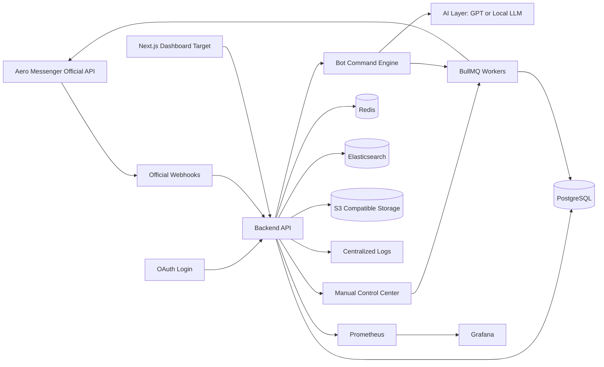

# Aero Messenger Production Architecture

## System Overview

AeroGroupGuard is designed as a platform-approved Aero Messenger bot with a web dashboard and operations backend.

## Components

- Frontend: responsive dashboard in `public/`; production target is Next.js using the same API routes and data contracts.
- Backend: Node.js API in `src/server.js`; production target is NestJS modules for auth, groups, commands, AI, reports, billing, manual control, and analytics.
- Bot domain: `src/aero-group-guard.js` handles command parsing, role checks, moderation, welcomes, summaries, and fallbacks.
- AI layer: `src/ai-assistant.js` centralizes assistant behavior and model configuration.
- Language layer: `src/i18n.js` provides detection and localized response strings.
- Database: PostgreSQL schema in `db/schema.sql`.
- Cache: Redis for rate limits, sessions, command cooldowns, and short-lived platform state.
- Queue: BullMQ for summaries, broadcasts, scheduled messages, exports, notifications, and retries.
- File storage: S3-compatible storage for exports, media attachments, and generated reports.
- Search: Elasticsearch for centralized logs, chat search, report search, and audit review.
- Logging: JSON logs and `audit_logs` table for compliance-grade traceability.
- Monitoring: health endpoint, structured logs, metrics, alert rules, and uptime checks.

## Scaling

Run the API as stateless containers behind a load balancer. Keep bot state in PostgreSQL and Redis. Use queue workers for expensive AI summaries, export jobs, translation jobs, and retryable platform calls.

## Disaster Recovery

- Point-in-time PostgreSQL recovery.
- Daily encrypted backups with 30-day retention.
- Redis treated as ephemeral cache.
- IaC-managed infrastructure rebuild.
- Runbook for bot token rotation and webhook re-registration.
