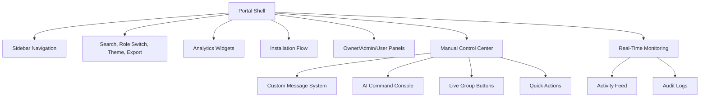

# Bot Management Portal

## Portal Areas

### Owner Portal

Owners can add or remove groups, enable or disable the bot, manage admins, configure commands, configure AI behavior, configure languages, view analytics, view reports, view logs, configure welcome messages, configure moderation settings, generate summaries, broadcast announcements, and manage subscriptions.

### Admin Portal

Admins can moderate users, review reports, configure assigned group settings, generate summaries, and view analytics for their assigned groups.

### User Portal

Users can view rules, submit reports, view FAQs, and request support. Users have no dashboard control access.

## Manual Control Center

The Manual Control Center gives owners and authorized admins direct control over the bot while preserving RBAC and audit logging.

### Custom Message System

- Send to one group, multiple groups, or all connected groups.
- Schedule messages through the queue worker.
- Save templates for announcements, maintenance notices, event reminders, poll invitations, and community updates.
- Preview recipient count and safety warnings before sending.

### AI Command Console

The console accepts natural-language instructions such as:

- Summarize today's discussion.
- Create announcement for tomorrow's event.
- Warn all users about spam.
- Generate weekly report.
- List most active members.
- Show unresolved reports.

Every execution is permission checked and written to audit logs.

### Live Group Control

Dashboard actions include send message, mention everyone, lock group, unlock group, enable slow mode, disable slow mode, generate summary, export chat data, review reports, and view logs.

### Automation Builder

Visual rules use this structure:

```text
IF trigger
WHEN condition
THEN action
```

Examples:

- IF user joins WHEN any group THEN send welcome message.
- IF message contains spam keywords WHEN confidence is high THEN warn user.
- IF report count is greater than threshold THEN notify admins.
- IF Sunday 8 PM THEN generate weekly summary.

## UI Wireframes



## Mobile Support

The portal uses responsive grid layouts. On mobile, the sidebar becomes a top navigation block, metrics collapse to one column, and Manual Control Center panels stack vertically.
