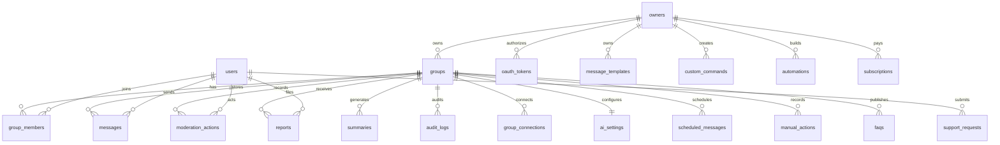

# Database Design

## ER Diagram

## Tables

- `owners`: deployed or linked bot owners.
- `groups`: Aero group configuration.
- `users`: Aero user records.
- `group_members`: role-based permissions and platform admin status.
- `messages`: chat history for summaries and analytics.
- `moderation_actions`: kick, ban, mute, warn, purge, lock, and unlock events.
- `warnings`: active and cleared warnings.
- `reports`: user-submitted issues.
- `summaries`: generated 7-day recap outputs.
- `audit_logs`: security and configuration change log.
- `oauth_tokens`: encrypted official API OAuth tokens.
- `group_connections`: official API, webhook, OAuth, bot token, and approved integration connection records.
- `ai_settings`: GPT/local LLM settings, custom prompts, and context memory options.
- `message_templates`: reusable welcome, announcement, event, reminder, moderation, and festival templates.
- `scheduled_messages`: queued manual or automated messages.
- `custom_commands`: no-code owner-created commands.
- `automations`: visual IF/WHEN/THEN automation rules.
- `manual_actions`: Manual Control Center execution records.
- `subscriptions`: SaaS plan and group limits.
- `faqs`: localized group FAQ entries.
- `support_requests`: user support tickets.

Indexes are included in [schema.sql](../db/schema.sql) for group timelines, reports, moderation history, audit history, and summaries.
